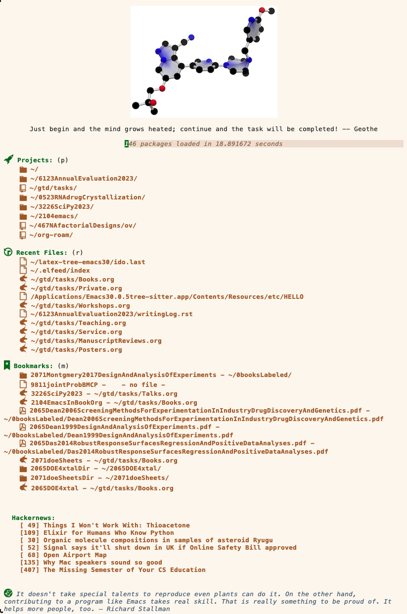

# Emacs Configuration with Support for Structured Editing

## Moved to Codeberg
I will try to keep this updated, but
go [[https://codeberg.org/MooersLab/emacs30init/src/branch/main/README.org][here]] for the most recent version.

## Purpose
This configuration supports structured editing of computer code with concrete syntax trees. 
The built-in package tree-sitter and the new package combobulate support this editing.
Emacs has to be compiled with support for tree-sitter.
See [[https://github.com/MooersLab/emacs30macos13treesitter][this repo]] for a protocol for compiling Emacs 30 from source code on macOS and this [[https://github.com/MooersLab/emacs30ubuntu22][one]] for doing likewise with Ubuntu. 
These protocols should work with Emacs 29.0.5.

This configuration file is also a rewrite of my basic configuration file with the packages in use listed at the top to speed up the start-up of Emacs.
The *package* package is used to install the missing packages rather than by using the `:ensure t` option in
*use-package*, but *use-package* is still used to customize and load packages when needed.
This massive rearrangement reduced the start-up time by about 30%.
Many thanks go to Jeff Bowman for this suggestion.

However, after two weeks of use, I am having trouble with only some of the elisp files in the *elpa* folder compiled after upgrading packages.
Fixing this issue can take 30 minutes.
I did not have this issue when I used `:ensure t` with use-package.
I think updating your packages sparingly is a good idea; once a month may be frequent enough.
Likewise, I also recommend using the emacs-server and emacsclient for instant access.

The *init.el* file was developed on Ventura (macOS 13.2), but it should be transferrable to older Mac operating systems.
There are several Mac-specific lines in the basic configuration section that can be quickly switched for use in Linux or Windows.
There are also several file paths that may need customizing. 
Both sites are marked with *;; ==> adjust here* in the init.el file.

The *manual-packages* folder contains the packages not added via accessing MELPA and company.
Their ~*.elc~ files will only work on Ventura with Emacs compiled the same way I compiled mine.
You may have to byte-recompile these packages.

## Features

The configuration file's content supports my academic research writing with occasional code writing for research purposes.

- Configured for structured editing with combobulate and tree-sitter.
- Uses the Vertico and friends for completion by default. I love the in-line documentation from Marginalia.
- Fuzzy matching is turned on for use in Ido.
- Can opt for the use of Helm or Icicles.
- Helm's helm-google-suggest command is very cool. Use *google-this* when helm-mode is toggled off.
- Configured for org-mode, org-agenda, org-babel, and org-roam to get organized, track notes, and do literate programming.
- Supports org-pomodoro.
- Supports pdf-tools.
- Uses booksmarks+, dired+, and iscicles (the last is off by default--it is a heavy-duty completion engine for the minibuffer). These require custom installation because they are on the Emacs Wiki and not in a repository. 
- Uses evil-nerd-commenter for smart commenting of lines and regions.
- Configured for Clojure, Python, and R programming.
- Supports the use of LaTeX via AUCTeX.
- Supports *google-this*. Make a selection and enter `C-c / g` to submit the selected region as a search term to Google in the default browser.
- Eglot is built into this version of Emacs.

I invoke org-Pomodoro with the point on a Project's headline in an org file to generate the logbook for storing the record of Pomodoros.
I store my lists of manuscripts, grant applications, service activities, etc, in separate org files rather than in a single task.org folder because I have too many projects for a single org file.
I bookmarked the headlines for specific projects to accelerate my access to a project via the *Bookmarks List* buffer.
I use the area under a project headline to store the logbook and relevant information.
I may not need the bookmarks if I used org-agenda for scheduling my daily activities, which I do not because it is too hard to stay on top of everything.
I just use org-agenda to schedule upcoming meetings.

Note that the bookmarks+ package runs on top of the built-in `bookmarks.e`l package. 
Bookmarks+ can bookmark a much more comprehensive array of items.
You can bookmark PDFs for later reading and websites of interest.
I find it much easier to bookmark URLs of heavily visited sites than to store them in my private index.html file.
You can also bookmark project directories and even `dired` buffers.

## What the landing page (dashboard) will resemble when first loaded

The default image for the dashboard is the Emacs logo. 
I substituted another image that is included above for testing.
The bottom of the dashboards has the top 10 Hackernews items.
This is an attention trap, so you may comment it out.

The startup time should be shorter on Linux and longer on Windows. 

I tried zsh and Bash. 
On the Mac, Emacs startup times were the same, although these two shells differ in the startup times of new tabs.
The Emacs binary starts up in a flash without an `init.el`. 

Note that bookmarks are normally accessed via the *bookmarks list* buffer, but some can be automatically listed on the dashboard.
For example, clicking on the icon in a book's PDF dashboard opens the book in Emacs for immediate reading. 
The bookmarks are a way of keeping track of material that needs to be read soon.
You can configure Emacs to use the *bookmarks* file as the startup page.

With bookmarks+, you add bookmarks to websites with the ~C-x x c u~ keybinding. 
You can also add bookmarks to directories. 
You can navigate to the directory of interest in a Dired buffer. 
With the directory name selected in the Dired buffer, enter ~C-x x m~ to add the directory as a bookmark. 
Remember to save the *bookmarks list* buffer. 
I add bookmarks to my writing projects on Overleaf, the project folder in my local drive, and a PROJ headline in my journalArticles.org file where I store my logbook for tracking my Pomodoros on a project. 
Thanks to Bookmarks+ and its developer, Drew Adams, I can quickly access any of those three locations with the click of a mouse. 

## Funding

- NIH: R01 CA242845, R01 AI088011
- NIH: P30 CA225520 (PI: R. Mannel); P20GM103640 and P30GM145423 (PI: A. West)

|Version      | Changes                                                                                                                                    | Date                 |
|:-----------:|:------------------------------------------------------------------------------------------------------------------------------------------:|:--------------------:|
| Version 0.2 |  Added funding and update table.                                                                                                             | 2024 May 3        |

