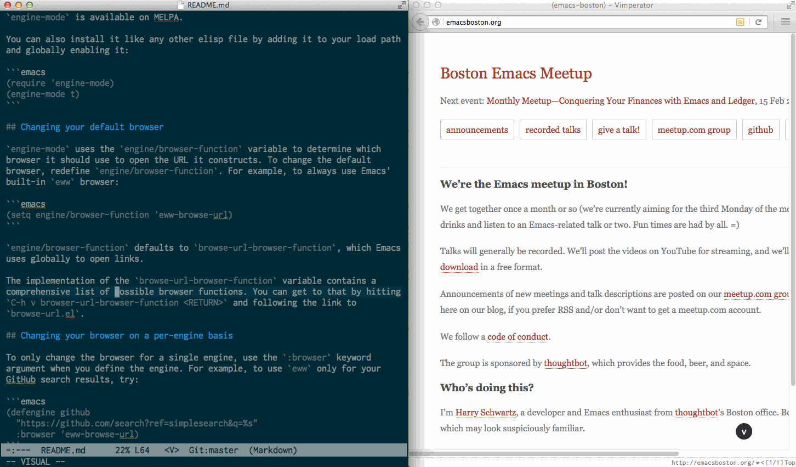

# engine-mode

[](https://melpa.org/#/engine-mode)
[](https://stable.melpa.org/#/engine-mode)
[](https://www.gnu.org/licenses/gpl-3.0)

`engine-mode` is a global minor mode for Emacs. It enables you to easily define
search engines, bind them to keybindings, and query them from the comfort of
your editor.



For example, suppose we want to be able to easily search GitHub:

```emacs
(defengine github
  "https://github.com/search?ref=simplesearch&q=%s")
```

This defines an interactive function `engine/search-github`. When executed it
will take the selected region (or prompt for input, if no region is selected)
and search GitHub for it, displaying the results in your default browser.

The `defengine` macro can also take an optional key combination, prefixed with
`engine/keymap-prefix` (which defaults to "C-x /"). That keybinding will be
wrapped in a call to `kbd`.

```emacs
(defengine duckduckgo
  "https://duckduckgo.com/?q=%s"
  :keybinding "d")
```

`C-x / d` is now bound to the new function `engine/search-duckduckgo`! Nifty.

If you'd like to see a video on the whys and wherefores of this mode, check out
[the talk @hrs gave at EmacsNYC].

## Installation

`engine-mode` is available on MELPA.

Using `use-package`:

``` emacs
(use-package engine-mode
  :ensure t

  :config
  (engine-mode t))
```

You can also install it like any other elisp file by adding it to your load path
and globally enabling it:

```emacs
(require 'engine-mode)
(engine-mode t)
```

## Changing your default browser

`engine-mode` uses the `engine/browser-function` variable to determine which
browser it should use to open the URL it constructs. To change the default
browser, redefine `engine/browser-function`. For example, to always use Emacs'
built-in `eww` browser:

```emacs
(setq engine/browser-function 'eww-browse-url)
```

`engine/browser-function` defaults to `browse-url-browser-function`, which Emacs
uses globally to open links.

The implementation of the `browse-url-browser-function` variable contains a
comprehensive list of possible browser functions. You can get to that by hitting
`C-h v browse-url-browser-function <RETURN>` and following the link to
`browse-url.el`.

## Changing your browser on a per-engine basis

To only change the browser for a single engine, use the `:browser` keyword
argument when you define the engine. For example, to use `eww` only for your
GitHub search results, try:

```emacs
(defengine github
  "https://github.com/search?ref=simplesearch&q=%s"
  :browser 'eww-browse-url)
```

As mentioned about, see the implementation of the `browse-url-browser-function`
for a definitive list of browsers.

## Changing the keymap prefix

The default keymap prefix for `engine-mode` is `C-x /`. If you'd like to bind
the keymap to an additional prefix (say, `C-c s`), you totally can:

```emacs
(engine/set-keymap-prefix (kbd "C-c s"))
```

If you use `use-package`, you can achieve the same thing with:

``` emacs
:bind-keymap ("C-c s" . engine-mode-prefixed-map)
```

## Custom docstrings

`defengine` assigns each engine a reasonable default docstring, but you can
override that on a case-by-case basis with the `:docstring` keyword argument:

```emacs
(defengine ctan
  "https://www.ctan.org/search/?x=1&PORTAL=on&phrase=%s"
  :docstring "Search the Comprehensive TeX Archive Network (ctan.org)")
```

## Modifying the search term before sending it

An engine might want to transform a search term in some way before it
interpolates the term into the URL. Maybe the term should have a different
encoding, or be capitalized differently, or, uh, be passed through [ROT13].
Whatever the reason, you can apply a custom transformation to a search term by
passing a function to `defengine` through the `:term-transformation-hook`
keyword argument.

For example, to UPCASE all of your DuckDuckGo searches:

```emacs
(defengine duckduckgo
  "https://duckduckgo.com/?q=%s"
  :term-transformation-hook upcase)
```

Or, to ensure that all your queries are encoded as latin-1:

```emacs
(defengine diec2
  "dlc.iec.cat/results.asp?txtEntrada=%s"
  :term-transformation-hook (lambda (term) (encode-coding-string term latin-1))
  :keybinding "c")
```

## Importing keyword searches from other browsers

Since many browsers save keyword searches using the same format as engine-mode
(that is, by using `%s` in a url to indicate a search term), it's not too hard
to import them into Emacs.

[@sshaw] has written a script to [import from Chrome on OS X]. Thanks for that!

## Engine examples

```emacs
(defengine amazon
  "https://www.amazon.com/s/ref=nb_sb_noss?url=search-alias%3Daps&field-keywords=%s")

(defengine duckduckgo
  "https://duckduckgo.com/?q=%s"
  :keybinding "d")

(defengine github
  "https://github.com/search?ref=simplesearch&q=%s")

(defengine google
  "https://www.google.com/search?ie=utf-8&oe=utf-8&q=%s"
  :keybinding "g")

(defengine google-images
  "https://www.google.com/images?hl=en&source=hp&biw=1440&bih=795&gbv=2&aq=f&aqi=&aql=&oq=&q=%s")

(defengine google-maps
  "https://maps.google.com/maps?q=%s"
  :docstring "Mappin' it up.")

(defengine project-gutenberg
  "https://www.gutenberg.org/ebooks/search/?query=%s")

(defengine qwant
  "https://www.qwant.com/?q=%s")

(defengine stack-overflow
  "https://stackoverflow.com/search?q=%s")

(defengine twitter
  "https://twitter.com/search?q=%s")

(defengine wikipedia
  "https://www.wikipedia.org/search-redirect.php?language=en&go=Go&search=%s"
  :keybinding "w"
  :docstring "Searchin' the wikis.")

(defengine wiktionary
  "https://www.wikipedia.org/search-redirect.php?family=wiktionary&language=en&go=Go&search=%s")

(defengine wolfram-alpha
  "https://www.wolframalpha.com/input/?i=%s")

(defengine youtube
  "https://www.youtube.com/results?aq=f&oq=&search_query=%s")
```

[the talk @hrs gave at EmacsNYC]: https://www.youtube.com/watch?v=MBhJBMYfWUo
[ROT13]: https://en.wikipedia.org/wiki/ROT13
[@sshaw]: https://github.com/sshaw
[import from Chrome on OS X]: https://gist.github.com/sshaw/9b635eabde582ebec442
